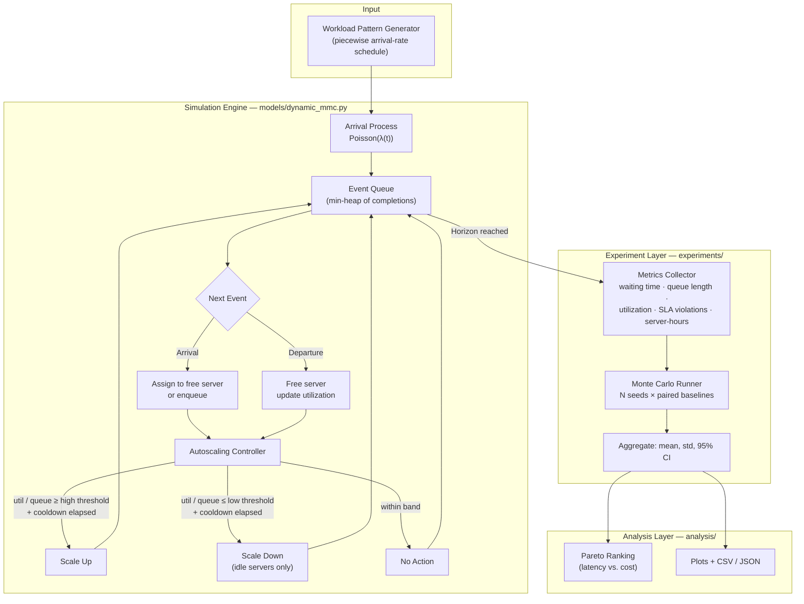
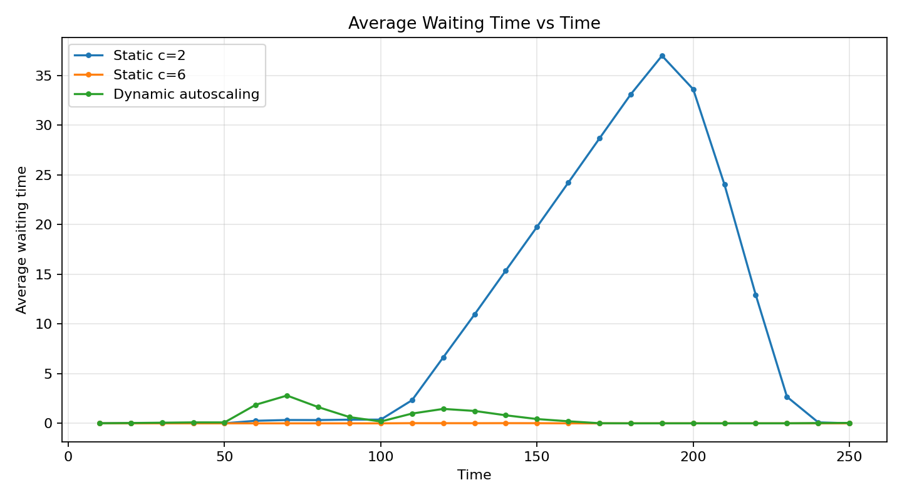
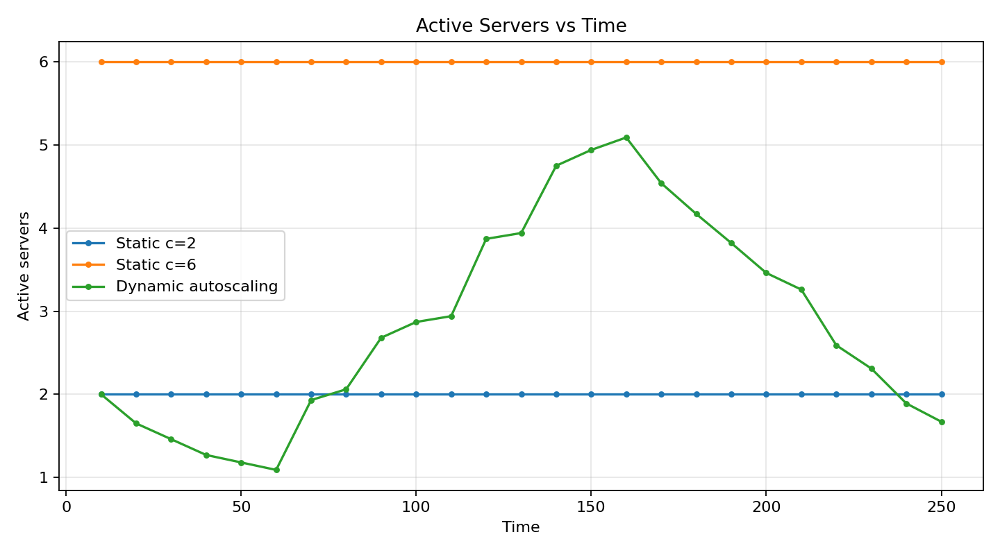

<h1 align="center">Dynamic Server Autoscaling Simulation using M/M/c Queueing Theory</h1>

<p align="center">
An event-driven queueing simulator comparing static provisioning against threshold-based autoscaling policies under varying workload patterns.
</p>

---

## Overview

This project models a server pool as an **M/M/c queue** and studies how different **autoscaling policies** respond to changing traffic. Instead of assuming a fixed number of servers, the system dynamically adds or removes servers based on live utilization and queue-length signals, using hysteresis and cooldown logic similar to real autoscalers (e.g. Kubernetes HPA, AWS Auto Scaling).

The core question the project answers: **when traffic is bursty or unpredictable, how much latency do you save by scaling aggressively — and how much does that cost in server-hours?**

To answer this, the simulator:
- Implements a discrete-event M/M/c engine (validated against closed-form Erlang-C theory)
- Runs 5 autoscaling policies (Aggressive, Balanced, Conservative, Fast-response, Queue-priority) against 5 workload patterns (steady, gradual ramp, sudden spike, step spike, repeated spikes, bursty)
- Benchmarks each dynamic policy against two static baselines (under-provisioned, over-provisioned)
- Runs paired Monte Carlo replications (100 seeds per combination) to get statistically meaningful comparisons
- Ranks policies on a **Pareto frontier of latency vs. cost** (avg. waiting time / SLA violation rate vs. server-hours)

---

## Architecture



**Key design decisions:**
- **Hysteresis** — separate high/low thresholds for scale-up vs. scale-down prevent flapping at the boundary.
- **Cooldown** — a minimum wait between scaling actions prevents reacting to transient noise.
- **Dual trigger** — scaling reacts to *either* utilization *or* queue length, whichever signals load first.
- **Paired seeds** — every policy and baseline sees the identical random arrival/service stream per replication, isolating the effect of the policy itself from simulation noise.

---

## Experiment Results

The full study produces well over 100 plots (5 workloads × 5 policies × 4 metrics), so I show a representative set.

**1. Static vs. Dynamic : does autoscaling actually help?**
Source: `experiments/results/waiting_vs_time.png` and `experiments/results/servers_vs_time.png`
Copy both into `docs/assets/`, then embed:




These are your strongest single pair — they show the dynamic policy tracking demand while a static c=2 baseline collapses under load and a static c=6 baseline sits idle.

**2. Policy comparison under one representative workload**
Source: `experiments/results/policy_study/plots/all_policies_by_workload/bursty_avg_waiting_time.png` and `bursty_avg_active_servers.png` (bursty is the most illustrative workload — pick a different one only if another tells a clearer story for your write-up)
```markdown


```

**3. Headline numbers table (paste as-is, no image needed)**

Static vs. dynamic baseline comparison (from `experiments/results/summary.csv`):

| System | Avg Waiting Time | SLA Violation Rate | Avg Active Servers | Server-Hours |
|---|---|---|---|---|
| Static c=2 (under-provisioned) | 14.38 | 68.98% | 2.0 | 500 |
| Static c=6 (over-provisioned) | 0.009 | 0.00% | 6.0 | 1500 |
| Dynamic autoscaling | 0.86 | 25.61% | 2.86 | 714 |

Cross-workload policy ranking (from `experiments/results/policy_study/policy_ranking.csv`, lower balanced score = better latency/cost trade-off):

| Rank | Policy | Avg Waiting Time | SLA Violation Rate | Server-Hours | Pareto-optimal |
|---|---|---|---|---|---|
| 1 | Aggressive | 1.73 | 30.30% | 741.9 | ✅ |
| 2 | Fast-response | 2.00 | 31.24% | 723.3 | ✅ |
| 3 | Queue-priority | 3.33 | 39.78% | 645.3 | ✅ |
| 4 | Balanced | 3.93 | 37.19% | 663.6 | ✅ |
| 5 | Conservative | 5.43 | 47.44% | 627.3 | ✅ |

All five policies land on the Pareto frontier — none is strictly dominated, so the "right" policy depends on whether you're optimizing for latency or cost.

Total images to embed: **4 plots + 2 tables**. That's enough to tell the full story without turning the README into a gallery. Keep everything else (the other ~115 plots) out of the repo entirely or in an uncommitted local folder — they're already regenerable via `plot_policy_study.py`.

---

## How to Run

```bash
pip install -r requirements.txt

# Validate simulator against theoretical M/M/1 and M/M/c formulas
python run.py

# Monte Carlo validation (simulated vs theoretical metrics)
python monte_carlo.py

# Parameter sweeps
python experiments/varying_lambda.py
python experiments/varying_mu.py

# Single dynamic-scaling run with decision log
python experiments/dynamic_scaling.py

# Static vs dynamic baseline comparison (Monte Carlo)
python experiments/compare_autoscaling.py
python experiments/plot_experiment_results.py

# Full policy × workload study (100 seeds each — takes a few minutes)
python experiments/policy_workload_experiments.py
python experiments/plot_policy_study.py
```

All results are written to `experiments/results/`.

---

## Limitations

- **Exponential-only assumptions** — arrivals and service times are modeled as Poisson/exponential (the M/M/c assumption). Real-world traffic and service times are often heavier-tailed, which would change absolute numbers even if the qualitative policy comparison holds.
- **Homogeneous servers** — every server is identical with the same service rate; no modeling of heterogeneous hardware or degraded-instance effects.
- **Instantaneous scaling** — adding a server takes effect immediately in the simulation. Real infrastructure has boot/warm-up latency, which would penalize aggressive policies more than shown here.
- **Fixed threshold/cooldown values** — thresholds aren't learned or auto-tuned; they're manually chosen per policy. A natural extension would be to search over threshold values rather than fix them.
- **No real infrastructure cost model** — "server-hours" is a proxy for cost, not a real cloud pricing model (spot pricing, reserved instances, etc. are not represented).
- **Single-resource bottleneck** — the model only tracks server-level queueing; it doesn't capture network latency, downstream dependencies, or multi-tier system effects.
